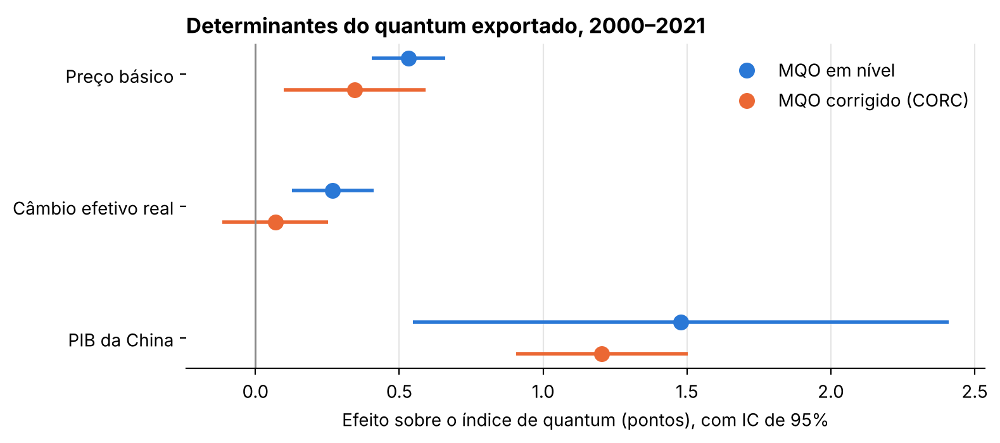

# Determinantes das exportações brasileiras, 2000–2021

Repositório de replicação do artigo **"Determinantes das exportações brasileiras no período 2000 a 2021"**, de Elena Soihet e Alexandre Pereira Saldanha. O código reproduz as regressões publicadas a partir dos dados originais, em Python.

> **Referência:** SOIHET, E.; SALDANHA, A. P. Determinantes das exportações brasileiras no período 2000 a 2021. In: *Anais do XVI Encontro Internacional da Associação Keynesiana Brasileira*. Niterói (RJ): Faculdade de Economia – UFF, 2023. ISBN 978-65-5941-955-5. Disponível em: [even3.com.br/anais/akb2023/669571](https://www.even3.com.br/anais/akb2023/669571-determinantes-das-exportacoes-brasileiras-no-periodo-2000-a-2021).



**Resultado principal:** o quantum exportado pelo Brasil está associado ao PIB chinês (proxy de demanda) e ao preço das exportações de produtos básicos (proxy de oferta). Corrigida a autocorrelação dos resíduos, o câmbio efetivo real deixa de ter efeito estatisticamente significativo.

---

## Pergunta

Quais fatores explicam o volume exportado pelo Brasil entre 2000 e 2021, período marcado pelo superciclo das commodities e pela ascensão da China como principal parceiro comercial?

## Dados

88 trimestres, de 2000 a 2021 ([`data/exportacoes_trimestral.csv`](data/exportacoes_trimestral.csv)). As séries mensais foram somadas por trimestre e não têm ajuste sazonal.

| Variável | Papel | Descrição | Fonte |
|---|---|---|---|
| `quantumexp` | Y | Índice de quantum das exportações | SECEX / Ministério da Economia |
| `preço_basico` | X1 (oferta) | Índice de preço das exportações de produtos básicos | SECEX / Ministério da Economia |
| `cambio_efetivo` | X2 (preço relativo) | Taxa de câmbio efetiva real, deflacionada pelo INPC | IPEADATA |
| `PIB_China` | X3 (demanda) | Variação do PIB nominal da China em relação ao trimestre anterior: 100 × PIB<sub>t</sub> / PIB<sub>t−1</sub> | National Bureau of Statistics of China |

## Estratégia empírica

$$Y_t = \beta_0 + \beta_1 X_{1t} + \beta_2 X_{2t} + \beta_3 X_{3t} + e_t$$

1. **MQO em nível.** O Durbin-Watson de 0,307 indica forte autocorrelação positiva dos resíduos.
2. **Correção de autocorrelação (CORC).** Com $\hat\rho = 1 - DW/2 = 0{,}847$, todas as variáveis são transformadas em quase-diferenças ($Z_t - \hat\rho Z_{t-1}$) e o modelo é reestimado. O Durbin-Watson passa a 2,301.

## Resultados

| | MQO em nível | MQO corrigido (CORC) |
|---|---:|---:|
| Preço básico | 0,532*** (0,064) | 0,344*** (0,124) |
| Câmbio efetivo real | 0,269*** (0,071) | 0,069 (0,092) |
| PIB da China | 1,479*** (0,468) | 1,204*** (0,150) |
| R² | 0,496 | 0,479 |
| Durbin-Watson | 0,307 | 2,301 |
| Observações | 88 | 87 |

Erros-padrão entre parênteses. *** p < 0,01. O notebook de replicação confere automaticamente que todos os coeficientes coincidem com os Quadros 3 e 4 do artigo.

## Robustez

O notebook [`02_robustez.ipynb`](notebooks/02_robustez.ipynb) testa a sensibilidade dos resultados, sem alterar a replicação:

- **Sazonalidade.** O artigo descreve `PIB_China` como um índice com base 100 em dezembro de 1999, mas os dados usados nas estimações medem a variação em relação ao trimestre anterior, sem ajuste sazonal. Como o PIB nominal chinês cai todo primeiro trimestre, a variável tem correlação de −0,96 com o indicador de 1º trimestre, e o quantum exportado também cai nesse período ([gráfico](output/figures/sazonalidade.png)). Com dummies trimestrais, o efeito da China deixa de ser significativo no MQO em nível, mas permanece no Cochrane-Orcutt iterativo.
- **Autocorrelação.** Erros-padrão Newey-West e Cochrane-Orcutt iterativo confirmam que o câmbio perde significância quando a autocorrelação é modelada.

A direção dos resultados se mantém; a magnitude atribuída à demanda chinesa depende do tratamento da sazonalidade. Uma especificação mais robusta usaria séries dessazonalizadas, o PIB chinês em nível e em logaritmo, e testes de raiz unitária e cointegração. Tabela completa: [`output/tables/robustez.csv`](output/tables/robustez.csv).

## Estrutura

```
├── data/
│   └── exportacoes_trimestral.csv
├── notebooks/
│   ├── 01_replicacao_mqo.ipynb   # replica os Quadros 3 e 4 do artigo
│   └── 02_robustez.ipynb         # sazonalidade e autocorrelação
├── output/
│   ├── figures/                  # correlações, coeficientes, resíduos, sazonalidade
│   └── tables/                   # coeficientes, estatísticas e robustez (.csv)
└── requirements.txt
```

## Como reproduzir

```bash
pip install -r requirements.txt
jupyter nbconvert --to notebook --execute --inplace notebooks/*.ipynb
```

Ou abra os notebooks no Jupyter e execute as células em ordem. O GitHub mostra os notebooks já executados, com todas as saídas.

## Autores

**Elena Soihet**, professora associada do Departamento de Ciências Econômicas, UFRRJ.
**Alexandre Saldanha**, economista e mestrando em População, Território e Estatísticas Públicas (ENCE/IBGE). [LinkedIn](https://www.linkedin.com/in/alexandre-saldanha-202a8592/) · [Lattes](http://lattes.cnpq.br/5148309722351266)

Código sob licença [MIT](LICENSE). Dados de fontes públicas: SECEX, IPEADATA e NBS.
